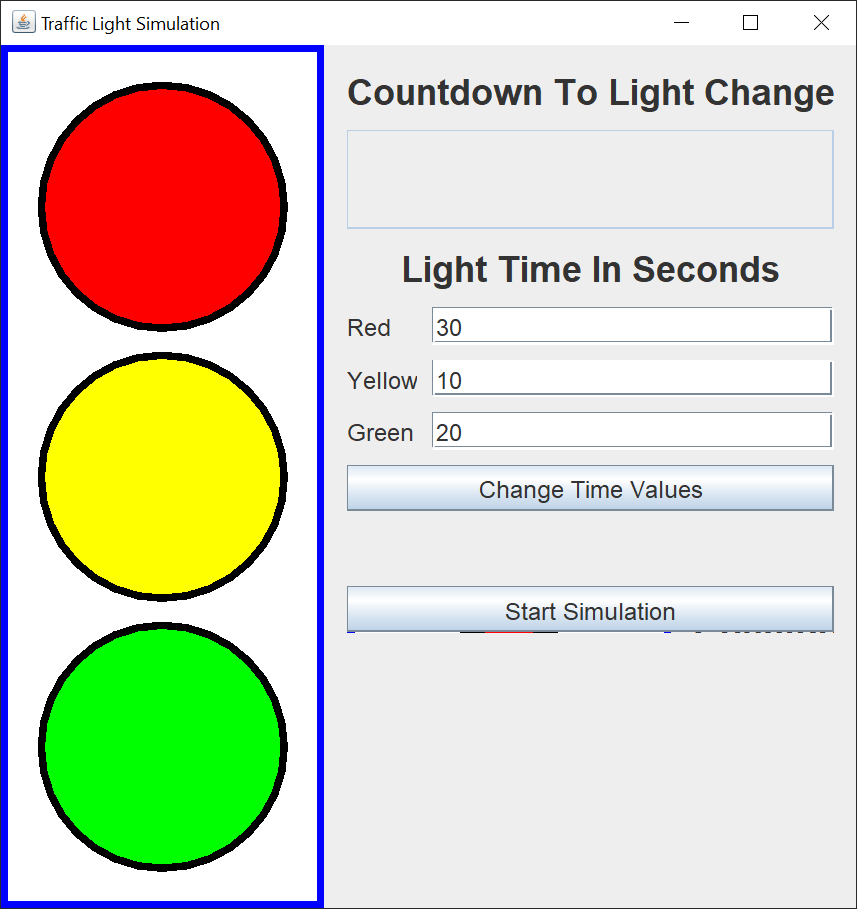
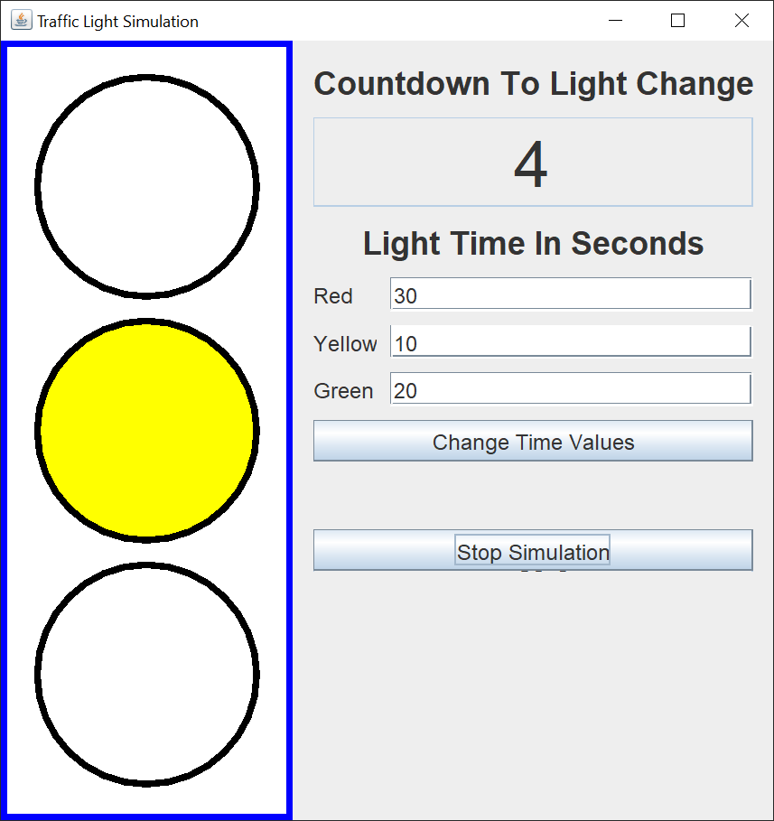

# Traffic Light Simulation

## Introduction

If you’re not familiar with Java Swing, Oracle has an excellent tutorial to get you started, [Creating a GUI With JFC/Swing](https://docs.oracle.com/javase/tutorial/uiswing/index.html). Skip the Netbeans section.

One of the common first GUI projects undertaken by Java Swing students is to create a traffic light.

I decided to create a Traffic Light Simulator GUI using Java Swing to illustrate several principles that are important when constructing a Swing GUI.

Here's the GUI I put together.

And here's the same GUI once the simulation has started.

The actual traffic light is a JPanel where the colored lights are drawn on.  You can see the red, yellow, and green in the first image.  When the simulator is running, only one light will be "on". as you can see in the second image.

The control JPanel on the right starts and stops the simulation and displays a light change countdown timer.  In addition, there's a form where you can adjust the times in seconds for the red, yellow, and green lights.  The minimum time you can make any light is 10 seconds.

The process to change the light times is to stop the simulation, adjust the times, and then start the simulation.  You can change the times while the simulation is running, but the application could abend.  If you type anything in the input fields besides an integer greater than or equal to 10, the code converts it to a 10.

## Explantion

When I put together a Java Swing GUI, I almost always use the [model / view / controller](https://en.wikipedia.org/wiki/Model%E2%80%93view%E2%80%93controller) pattern.  This pattern helps me separate concerns and allows me to focus on one part of the application at a time.

This application has two model classes, three view classes, and three controller classes.  I made all the classes inner classes so I could keep this entire application in one file.  This makes the code easier to post and share.  For most projects, I recommend putting each class in a separate file, and separating the model, view, and controller classes into sseparate packages.

### Model

The TrafficLight class is the model for one of the traffic lights.  This class holds the light Color, a boolean that tells whether the light is on or off, and an int timer that keeps track of the time in seconds that the light remains on.

The TrafficLightModel class creates and modifies three instances of TrafficLight, one for the red, yellow, and green lights.  The default times for these lights are set here.  This class has several methods that gets information from and passes information to the individual instances of TrafficLight.

These two classes are a good example of how to create an object and a collection of those objects.  In this case, the collection is an array, because we know that there will be three traffic lights.

### View

The application starts with a call to the SwingUtilities invokeLater method.  This method ensures that the Swing components are created and executed on the [Event Dispatch Thread](https://docs.oracle.com/javase/tutorial/uiswing/concurrency/dispatch.html).

The model is instantiated in the constructor of the main view class, the TrafficLightSimulation class.

The JFrame is constructed in the run method of the TrafficLightSimulation class.  The addWindowListener method allows me to stop the simulation animation before I dispose of the JFrame.  The two main JPanels, the drawing panel and the control panel, are created in their own classes.

The TrafficLightSimulation class has four helper methods that start, pause, reset, and stop the simulation animation.  There are also seveal other helper methods that update or repaint various parts of the view.  The controller classes don't need to know about the internal workings of the view.  All they need to know is that the main view class has methods to update the view.

The ControlPanel class constructs a JPanel to hold the control panel Swing components.  The control panel consists of an outer JPanel with a FlowLayout and an inner JPanel with a GridBagLayout.  The GridBagLayout centers the Swing components within a JPanel, and the FLowLayout in the outer JPanel brings the inner JPanel to the top of the GUI.

The DrawingPanel class draws the traffic light in a drawing JPanel.  We override the paintComponent method of JPanel to draw the circles and fill in the appropriate circles.

Both of these classes get their information from the application model.  Neither of these classes update the spplication model.  The controller classes will update the application model and update the view.

### Controller

The ControlPanel class has an inner controller class, the ChangeTimeListener class.  The ChangeTimeListener class reads the timer values from the JTextFields and stores them in the individual TrafficLight instances.

The StartStopAnimationListener class controlls the starting and resetting of the animation timer.

The Animation class is a Runabble, running in a separate Thread, that animates the traffic light simulation.  The animation is a bit complex.  First, the run loop adjusts the countdown timer.  Then, when the countdown timer reaches zero, changes the light to be displayed in the model, resets the countdown timer with the next light's timer, and koops back to adjust the countdown timer again.

A boolean in the Animation class allows us to "pause" and "resume" the timer.  What actually happens is that the animation loop continues to run, but doesn't update the model nor updates the view.  The animation loop just runs until the simulation is resumed or the application closes.
